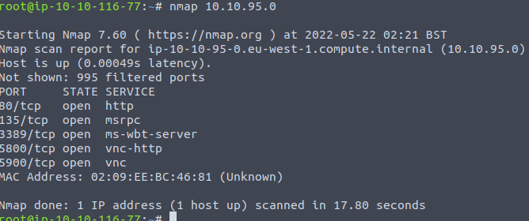

# TryHackMe HotelKiosk Official Writeup
I created the [HotelKiosk box on TryHackMe]() to highlight my first two CVEs ([CVE-2021-42949](https://github.com/dhammon/HotelDruid-CVE-2021-42949) and [CVE-2021-42948](https://github.com/dhammon/HotelDruid-CVE-2021-42948)) found from inspiration through TheMayor's blog post [I Was Bored One NIght and Found Two CVEs](https://medium.themayor.tech/how-i-was-bored-one-night-and-found-two-cves-4233c3719194).  I also drew inspiration from John Hammond's [Kiosk Breakout YouTube series](https://youtube.com/playlist?list=PL1H1sBF1VAKUFRYvl-OO0Odzpp-9piVZO) where he covers the setup and escape of Windows native kiosk mode.  Finally, special thanks to 0z09e's awesome code injection with [CVE-2022-22909](https://github.com/0z09e/CVE-2022-22909).

## Reconnaissance
### Nmap
Conducting a basic nmap scan for common ports.



Interesting ports discovered include
- 80 HTTP
- 8009 VNC

## Enumeration
### HTTP port 80
#### Manual Review
Opening a browser and navigating to the server's site provides some information that the server likely belongs to a hotel.  The site's page provides some interesting information, such as the WiFi password, a manager user, and that there is a kiosk available for hotel guests.


#### Directory Busting 
The site has no robots.txt file, hyperlinks, and appears to have html static pages being served.  Directory busting the server reveals an interesting file ```notes.txt```.


### Research
Reading the `notes.txt`, which appears to be written by a manager, references a `hoteldruid/` directory, CVEs of interest, an implied version of <3.0.3, a hint to review `/access.log`, and a hint that the hotel's kiosk is being used to book reservations.


#### CVEs
Googling each CVE takes us to dhammon and 0z09e's Github pages.  Reading their CVE writeups we learn some interesting facts:
- CVE-2021-42949: *The session id is correlated with other data stored (remote_addr and user-agent) which partially mitigates this issue; however, the user agent can be guessed/known and the remote_addr can by bypassed by using the same computer as the vulnerable session and/or irrelevant if, for example, the webapp is behind a reverse proxy.*
- CVE-2021-42948: *The session token plaintext is exposed in GET requests which can be intercepted by attackers through proxies, man in the middle attacks, or similar and used to hijack application user sessions.*
- CVE-2022-22909: *A Code Injection vulnerability has been found on the Hotel Druid v3.0.3 application, which an attacker could exploit to execute remote code on the server. For a successful exploitation, an attacker should have the privilege to add a new room.*

We know from the `notes.txt` file that the manager is using the kiosk to book reservations and that the kiosk server is running the Hotel Druid web application.  If we can get on the box we may be able to find the referenced `/access.log` and discover the manager's session token from GET requests.  From there we might be able to leverage the code injection vulnerability to escalate privileges. 

## Foothold

### VNC
The VNC connection requires a password so we try the WiFi password `HotelCalifornia` that was provided on the splash page of the website.


### Kiosk Escape (user.txt)
The VNC connection drops us logged into the computer; however, functionality is greatly diminished as Windows kiosk mode is enabled.  Fumbling around and trying different [hacktricks](https://book.hacktricks.xyz/hardware-physical-access/escaping-from-gui-applications#accessing-filesystem-from-the-browser) eventually leads us to the ability to access the file system using `file:///c:/` in the address bar.


First place to check is the current user's desktop where the user.txt file is located:


## Privilege Escalation (root.txt)
Now that we have file access, let's check out the `/access.log` file that was referenced in the `notes.txt` found during directory busting.


In the access log we find local connections being made to authenticated pages.  This traffic must be from the hotel's employees or manager to book reservations as suggested in the `notes.txt` file.  A closer look at the log shows that session IDs are included as GET parameters, which is consistent with research from CVE-2021-42948.  With this traffic we can hijack the user session, but only directly from the kiosk machine as CVE-2021-42949 advises that the remote address_addr from the header of web traffic is used to authenticate sessions.


With authenticated access to the machine, we can leverage the remote code execution vulnerability discussed in CVE-2022-22909.  This exploit requires us to create a new room with the name `{${system($_REQUEST[cmd])}}`. 


With the new room created, we navigate to `/dati/selectappartamenti.php` and supply the GET parameters `?cmd=whoami /all`. 


Now that we have code execution as the manager who is also the local administrator, we can grab the root.txt file with `?cmd=type c:\users\manager\Desktop\root.txt`.


